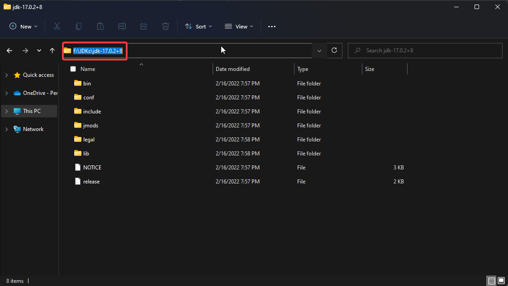

## What's a Java Toolchain?

[Gradle](https://gradle.org/) has this neat little concept they've been working on lately, called _toolchains_. A _toolchain_ is basically just the tools that a JDK contains -- `javac`, `javadoc`, etc -- but provided to you in a way such that you can configure what exact tools your Gradle project uses.

In FastJ, we've used this technology to set the general language version to be 17 -- targeting `Java 17`:

```groovy
java.toolchain.languageVersion.set(JavaLanguageVersion.of(17))
```

This means the entire project will make use of Java 17 for compilation, runtime execution, javadoc generation, and so on. This also means that Gradle will use Java 17 when being run. 

The best parts are still coming up, though:

- Gradle automatically detects what JDKs you have installed, and will use that to select the correct JDK for your project. (You can see what order it detects these JDKs in [here](https://docs.gradle.org/7.4/userguide/toolchains.html#sec:precedence).)

- If you don't have a version of Java installed that matches the toolchain requirement, **Gradle will automatically download the correct version of Java for you.** That's right -- they'll handle all this for you if you don't. You'll never have to worry about downloading Java at this rate.

## Viewing Toolchains

You can view what toolchains Gradle detects by using `gradle -q javaToolchains` in the command line. Gradle will spit out all the SDKs it detects, general information about them, as well as what detected it.

```powershell
PS F:\github\lucasstarsz\FastJ> gradle -q javaToolchains

 + Options
     | Auto-detection:     Enabled
     | Auto-download:      Enabled

 + Eclipse Temurin JDK 11.0.14.1+1
     | Location:           C:\Users\XXXXX\.gradle\jdks\adoptium-11-x64-hotspot-windows
     | Language Version:   11
     | Vendor:             Eclipse Temurin
     | Architecture:       amd64
     | Is JDK:             true
     | Detected by:        Auto-provisioned by Gradle

 + OpenJDK 11.0.2+9
     | Location:           F:\JDKs\jdk-11.0.2
     | Language Version:   11
     | Vendor:             Oracle
     | Architecture:       amd64
     | Is JDK:             true
     | Detected by:        Current JVM

PS F:\github\lucasstarsz\FastJ>
```

## I'm not seeing all my JDKs...

If you have multiple JDKs on your system, and the one you want to use isn't being detected, you can get it detected by Gradle with a few simple steps.

Note: I use Windows 11 -- the UI is similar to Windows 10. U/nix devices contain sufficient guides online anyways.

1. **Locate your JDK and its path, and copy this for later usage.** Make sure to copy the path, right up to its root folder.
   

2. **Add an environment variable to your system that points to this JDK.** This can be named whatever you like -- I chose to name it `JDK17` for ease of use.

   - On Windows, you can search `Edit the system environment variables` in Windows' start menu search.
   - Once you've opened that, under the `Advanced` tab select `Environment Variables...` from the bottom right.
   - Add a user variable by clicking the `New...` button below the `User variables` section.

   

3. **Add the environment variable to Gradle's list of java installations.** To do this, you'll need to access your user's `gradle.properties` file. Not your repo, your _user_. The user of your system, that is.

   - On Windows, I needed to create my gradle properties file at `C:/Users/XXXXX/.gradle/gradle.properties`.
   - Inside the file, I added the property `org.gradle.java.installations.fromEnv` and set it to my named environment variable -- `JDK17`.

   

And that's all! You should now be able to see your toolchain in the list of toolchains. (You may need to restart your IDE/editors for this to take effect)

```powershell
PS F:\github\lucasstarsz\FastJ> gradle -q javaToolchains

 + Options
     | Auto-detection:     Enabled
     | Auto-download:      Enabled

 + Eclipse Temurin JDK 11.0.14.1+1
     | Location:           C:\Users\XXXXX\.gradle\jdks\adoptium-11-x64-hotspot-windows
     | Language Version:   11
     | Vendor:             Eclipse Temurin
     | Architecture:       amd64
     | Is JDK:             true
     | Detected by:        Auto-provisioned by Gradle

 + Eclipse Temurin JDK 17.0.2+8
     | Location:           F:\JDKs\jdk-17.0.2+8
     | Language Version:   17
     | Vendor:             Eclipse Temurin
     | Architecture:       amd64
     | Is JDK:             true
     | Detected by:        environment variable 'JDK17'

 + OpenJDK 11.0.2+9
     | Location:           F:\JDKs\jdk-11.0.2
     | Language Version:   11
     | Vendor:             Oracle
     | Architecture:       amd64
     | Is JDK:             true
     | Detected by:        Current JVM

PS F:\github\lucasstarsz\FastJ>
```